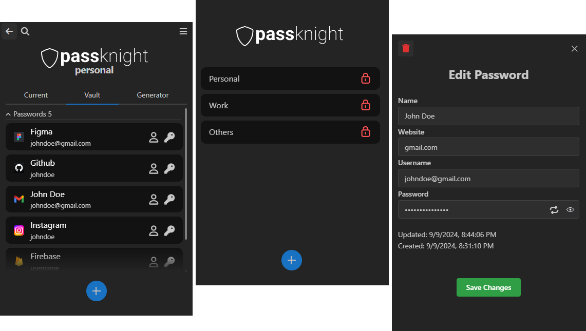

<h1 align="center">
    
</h1>

<h3 align="center">Self hosted, multi vault, secure password manager.</h3>

<br>
<p align="center">
  </img>
</p>

## Table of Contents
1. [Description](#description)
    1. [Features](#features)
    2. [Autofill](#autofill)
    3. [Clipboard](#clipboard)
    4. [Supported platforms](#supported-platforms)
2. [Security](#security)
3. [Firebase setup](#firebase-setup)
4. [Notes](#notes)

# Description

Passknight is a cross-platform, user-configured cloud hosted password manager that uses [Firestore](https://firebase.google.com/docs/firestore) as it's backend. It provides a secure environment for storing and managing credentials and secure notes with it's security implementation and firestore rules.

It supports multiple users / vaults, making it easy to organize your passwords and notes.

## Features
- Multiple vaults
- Store credentials and secure notes safely
- Synced between devices
- Strong password generator with custom options
- Authentication persistence for easier access and convenience. For the duration of the session (browser) and with custom timeout (Android)
- Local vaults, no need for firebase (only for windows)
- Autofill
- Auto clipboard clearing

## Autofill

On **Android** you have to go to settings and set Passknight as the current autofill service.

The autofill service prioritizes input fields that have autofill hints enabled, if those are not found it checks the hint or text attribute (on Android [see more](https://github.com/hypertensiune/Passknight/blob/667b58f5b48b04f701651497abd4ed5956ffcbb1/android/app/src/main/java/com/example/passknight/PkAutofillService.kt#L139)) and the type or name attribute (on browser [see more](https://github.com/hypertensiune/Passknight/blob/667b58f5b48b04f701651497abd4ed5956ffcbb1/extension/public/content.js#L51)). If the inputs on a page or app don't have any of those, autofill will not be possible. 

As a solution for those situations, **with the browser extension**, users can manually select fields and what to fill them with.

**On Android**, unfortunatelly, the only other options is to copy & paste from the vault. 


## Supported platforms
- **Chromium based browsers**
- **Windows**
- **Android 11 and newer**

<br><br>

# Security

The security measures used by Passknight are heavily inspired by those implemented by Bitwarden. See https://bitwarden.com/help/bitwarden-security-white-paper/ for more details.

Due to this if a bad actor gets the content of the vault (like a possible breach of firebase accounts, badly formatted firestore rules, etc) data is still safe as credentials and the symmetric key are fully encrypted using the master password which is never sent to the cloud. **For this reason, if the master password is forgotten there is no way for it or the stored items to be recovered**.

Each passknight vault is represented by a user in firebase. The vault's **master password** is the base material used to derive a password used to login in firebase - the master password hash.

### Master password hash 

A **256 bit master key** is derived using **600,000** iterations of **PBKDF2 SHA-256** and a salt of the email address used in firebase (vaultname@passknight.vault).

The **master key** is then derived again with the same **PBKDF2** algorithm but this time the salt used is the vault's master password. The resulting key is the **256 bit master password hash**.

### Symmetric key

The **256 bit symmetric key** is used for all encryption and decryption operations. It is randomly generated during vault creation and it is encrypted using the **stretched master key** with **AES-256** before being stored in the vault for further use.

The **stretched master key** is obtained from the **master key** by using **HKDF** and is expanded to 512 bits.

### Authentication and vault unlocking

When the user wants to unlock a vault the same process is repeated. The **master key** is derived from the the email and vault's master password and the master key is derived again to get the **master password hash** which is used to authenticate in firebase.

If authentication is successfull the vault content and the associated **protected symmetric key** is fetched from firestore, the latter being decrypted to obtain the **symmetric key**.

### Encryption & Decryption

To encrypt and decrypt your passwords, Passknigth uses the **AES-CBC** algorithm with a randomly generated 16 bytes IV.


### Cryptography libraries

- Browser extension - [WebCrypto API](https://developer.mozilla.org/en-US/docs/Web/API/Web_Crypto_API)
- Windows - [.NET Cryptography](https://learn.microsoft.com/en-us/dotnet/standard/security/cryptography-model)
- Android - [OpenSSL](https://www.openssl.org/)/[BoringSSL](https://boringssl.googlesource.com/boringssl). Using this with native C++ as Java's cryptography implementation is too slow and not suitable for the application

<br><br>

# Firebase setup

**This is optional for the windows app as it also has locally stored vaults.**

- Login to [firebase](https://firebase.com) and create a new project.
- Register a **web app**. 
- Go to **authentification** and add the <u>Email/Password</u> provider.
- Enable **Firestore Database** and add the following rules in the ```rules``` tab:
```
rules_version = '2';

service cloud.firestore {
  match /databases/{database}/documents {
    match /vaults/ids {
    	allow write, read;
    }
    
    match /{vault}/{document=**} {
    	allow write, read: if request.auth != null && request.auth.uid == vault
    }
  }
}
```

### Android

Open the settings and fill in the required firebase information.

### Windows

Create a file ```firebase``` in the application root directory and paste the firebase API KEY:
```
[API_KEY]
```

### Web extension
To initialize Firebase create a file called ```firebaseConfig.js``` in the extension's folder that should look like this:
```
const firebaseConfig = {
    apiKey: "",
    authDomain: "",
    projectId: "",
    storageBucket: "",
    messagingSenderId: "",
    appId: ""
};
window.firebaseConfig = firebaseConfig;
```

### Your config can be found in Project settings > General.

# Notes

- The **android** app requires the lock screen to have at least a PIN, pattern or password. Recommended is to use a stronger, biometric option like a fingerprint. It is also more convenient to be used this way as the app requires aditional authentication with the lock screen method **before** unlocking the vault.

- On **Android** the clipboard manager is unaccessible when the app is in the background so the clipboard can be cleared only when the app is exited (**If the app is terminated by the system or manually the clipboard will not be cleared**). 

  Also, different keyboards handle clipboard clearing in different ways. Actually the clipboard cannot be cleared, what Passknight is doing is writing many empty items to the clipboard to completely overwrite the history. (the number of items to write can be changed in settings)
